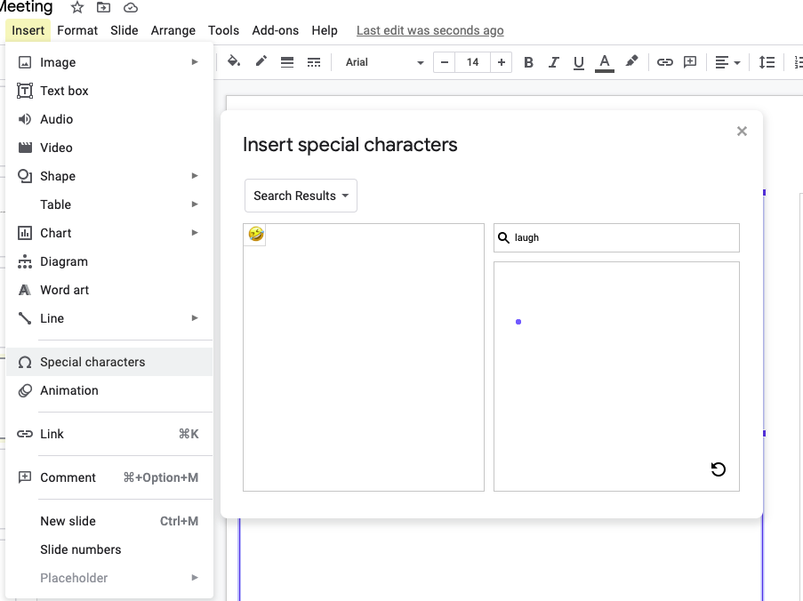

# emoji-everywhere
Browser extension for automatically converting slack/messenger like key patterns to emojis

User story:
- User types `:laughing:` somewhere on a site
- Extension automatically replaces it with 😆.

## Motivation:
Emoji is such a good way to express emotion. However, inserting emoji is still such a pain in most websites. Following is a list of famous websites and the pain one needs to go through for inserting a lousy emoji:

- **Google Slides (Google docs as well)**: Go to Insert>Special Characters. Search for emoji (its highly unlikely to find the emoji you want)

- **LinkedIn**: No native way to insert emoji (you need to copy paste an emoji from somewhere to insert emojis)

- 

## Requesting Contributions:
- LMK (email: sa3762@columbia.edu) if you are interested in this idea.
- I am pretty busy right now but can provide some guidance on development (have [some experience with chrome extensions](https://github.com/PornBlock/PornBlock))
- If you make serious progress, you can own the idea and the repository. I can be the second collaborator and will be just happy to see the idea in action.
